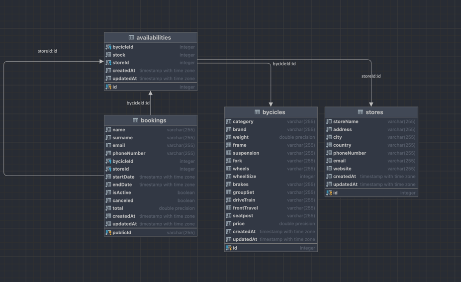

# Cycling together API

[](https://www.npmjs.com)  [](https://github.com/nodejs/node) [](https://jestjs.io) [](https://github.com) [](https://www.openapis.org) [](https://expressjs.com)

<!--[](https://github.com/OAI)-->

---

## **1.0 - Introduction**

In the scenario where we would own a store, our business is to actually have an API where you iterate over the bycicles your store has. Considering that, imagine that you have two entities:
bycicles and stores.

You can be attached to other stores, that stores give you a bunch of bycicles to rent them, sell them or whatever, and then you have the bycicles.

This API is about that, iterating over the bycicles, making some CRUD and applying filters to get the kind of bycicle that the user wants, and then you can see which stores are afiliated with you and even afiliate with more stores.

---

## **2.0 - Get started**

To start running the project, make sure to do these steps:

- Install all the dependencies:

  npm install <!-- This should install dependencies and devDependencies -->

- If you want to use Docker to set up your database:

  docker compose up <!-- or use the one below  -->
  npm run db:start

Creating the database container will create a new directory that will store all the data that you will put into the database.

- Configure the environments for the database configuration

That environment files must be inside the directory "./app/src/config",
the file must have the following parameters:

<!-- dev.env -->

- NODE_ENV=dev
  The node environment, this with the DB parameter will determine which database are you going to operate

- HOST=localhost
  The hostname

- DBUSER=postgres
  The database user, if you use the docker-compose.yaml you must specificate the value of the "POSTGRES_USER"

- PASSWORD=postgres
  The database password, if you use the docker-compose.yaml you must specificate the value of the "POSTGRES_PASSWORD"

- PORT=5432
  Port by default that postgres uses

- DB=cycling_together_dev
  The name of the database you are going to operate with

- DIALECT=postgres
  The dialect you are going to use in Sequelize, basically to know which driver the ORM will need.

- LOGGING=true
  Set true if you want to see the database operations on the console.

There are three types of .env files:

- **test**: Used just for testing, is not actually required if you don't want to do any tests.
- **dev**: Used to develope the app
- **prod**: For deployment use

If you don't want to make any development, you can just write down the prod.env file. **Consider that if you want to put different names to the env files, you will have to change the "cross-env NODE_ENV=xx" in the package.json**

- Finally, you can use:

  npm run start

---

## **3.0 Technologies**

- **Language**: JavaScript
- **Framework**: Express
- **Testing frameworks**: Jest and Supertest (for http calls)
- **Documentation**: OpenAPI
- **ORM**: Sequelize
- **Database**: PostgreSQL
- **Development rules (for standard conding format)**: eslint

---

## 4.0 Database scheme



---

## 5.0 FAQ

### How can I create a .env file with a different name?

Well, imagine that you want to write a .env file called "production.env", you will need to change a few things:

In order to know why do you have to do this, is because in the **dbconfig.js** the environment variables are resolved with the name that you set up with the NODE_ENV parameter on the package json:

```js
dotenv.config({
  path: path.resolve(__dirname, `${process.env.NODE_ENV}.env`),
});
```

- So first of all, create or change the file name to "production.env"
- Then, change the script in the package json, change NODE_ENV=prod to NODE_ENV=production

```json
"scripts": {
    "test": "cross-env NODE_ENV=test npm run seed:test && jest --detectOpenHandles",
    "test:models": "jest ./app/test/models",
    "test:coverage": "cross-env NODE_ENV=test npm run seed:test && jest --detectOpenHandles --coverage",
    "dev": "cross-env NODE_ENV=dev nodemon ./bin/www",
    "start": "cross-env NODE_ENV=production node ./bin/www", // CHANGE HERE
    "db:start": "docker compose up -d",
    "db:stop": "docker compose down",
    "seed:test": "cross-env NODE_ENV=test node ./app/src/db/seeders/dbSeeder.js",
    "seed:dev": "cross-env NODE_ENV=dev node ./app/src/db/seeders/dbSeeder.js",
    "seed:prod": "cross-env NODE_ENV=production node ./app/src/db/seeders/dbSeeder.js", // AND HERE
    "lint": "./node_modules/.bin/eslint ./",
    "lint:fix": "./node_modules/.bin/eslint ./ --fix",
    "precommit": "npm run lint:fix && npm run test"
  }
```

---

### What are the scripts that start with "seed"?

These are actually seeders! These are used if you want to have actual data in the database, what they do is to connect to the database (configured in the env files), create the proper tables and insert data.

There are three of them because there are three diferent databases:

- cycling_together_test: Used when tests are running.
- cycling_together_dev: Used in development of the app.
- cycling_together: Used in production

Again, these database names are susceptible to change, you just have to change the parameter DB in the .env file and change the init.sql that is stored inside the ./docker directory:

```env
... Settings

DB=new_database_name

...
```

```sql
DROP DATABASE IF EXISTS new_database_name; -- change here!
DROP DATABASE IF EXISTS cycling_together_dev;
DROP DATABASE IF EXISTS cycling_together_test;

CREATE DATABASE new_database_name; -- and here!
CREATE DATABASE cycling_together_dev;
CREATE DATABASE cycling_together_test;
```
